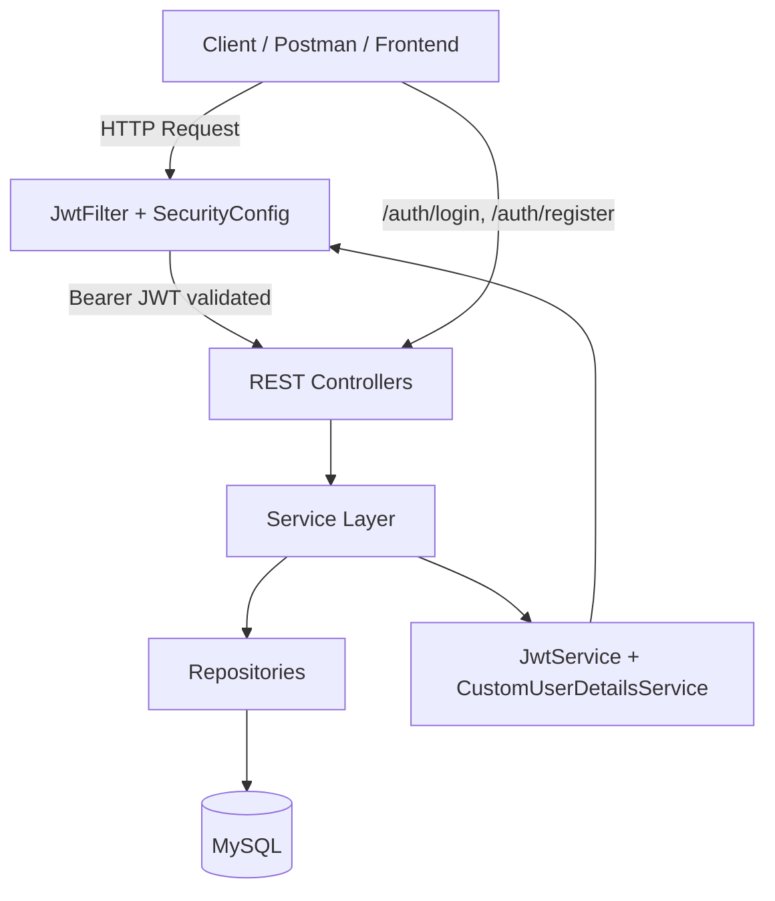
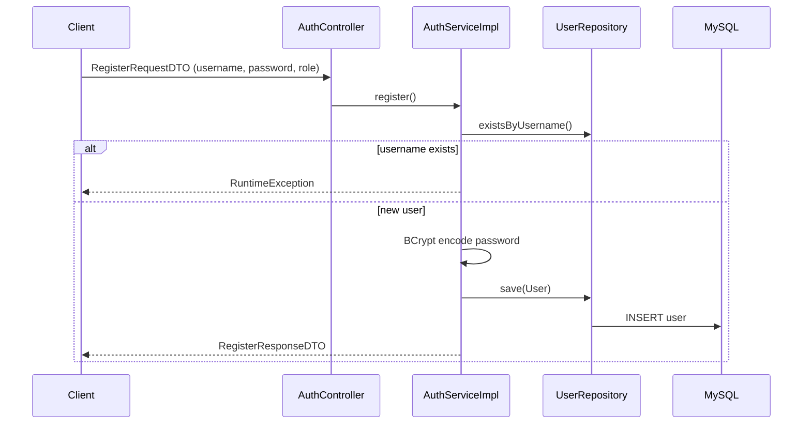
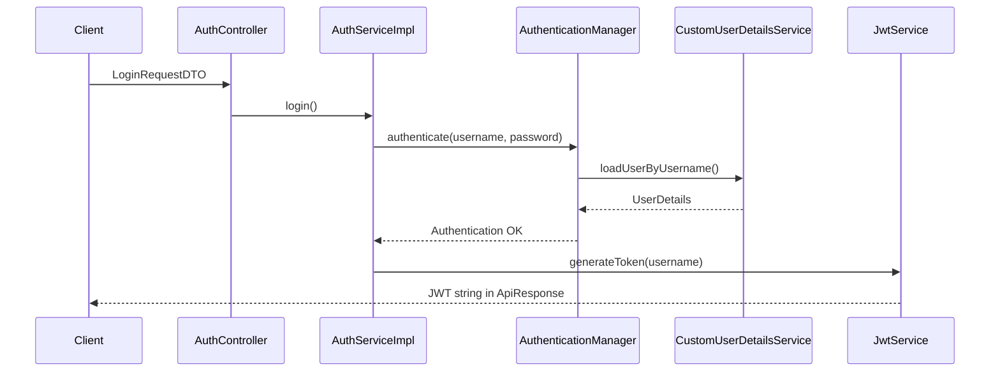
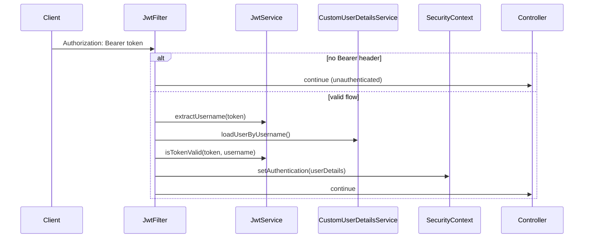
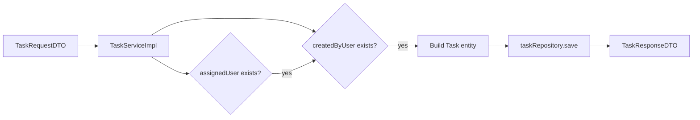

# Spring Boot TMS (Task Management System)

REST API for user and task management, built with Spring Boot, Spring Security (JWT), Spring Data JPA, and MySQL.

---

## Skills and technologies used

| Category | Skills / tools |
|----------|----------------|
| **Language** | Java 21 |
| **Framework** | Spring Boot 4.0.3, Spring Web MVC, Spring Data JPA, Spring Security |
| **Security** | JWT (JJWT), BCrypt password hashing, stateless authentication, `UserDetailsService` |
| **Database** | MySQL, Hibernate ORM, entity relationships (`@ManyToOne`, `@OneToMany`) |
| **API design** | RESTful endpoints, DTO pattern, unified `ApiResponse` wrapper |
| **Validation** | Jakarta Bean Validation (`@NotBlank`, `@NotNull`) on request DTOs |
| **Error handling** | `@RestControllerAdvice` with global exception handlers |
| **Build** | Maven, Spring Boot DevTools |
| **Utilities** | Lombok (`@RequiredArgsConstructor`, getters/setters) |
| **Concepts** | Layered architecture, dependency injection, repository pattern, filter chain |

---

## High-level project flow



**Request path (protected APIs):**

1. Client sends HTTP request with `Authorization: Bearer <token>`.
2. **`JwtFilter`** runs before controllers, parses the token, loads the user, and sets `SecurityContext`.
3. **`SecurityConfig`** allows the request only if the user is authenticated.
4. **Controller** receives the request and delegates to **Service**.
5. **Service** applies business rules and uses **Repository** to read/write **MySQL**.
6. Response is wrapped in **`ApiResponse<T>`** and returned as JSON.

---

## Application flows (by feature)

### 1. User registration (`POST /auth/register`)



**Logic:**

- Check duplicate username via `UserRepository.existsByUsername()`.
- Create `User` entity with **BCrypt-encoded** password and `Role` (`USER` / `ADMIN`).
- Persist and return `RegisterResponseDTO` (id, username, role).

---

### 2. Login and JWT issuance (`POST /auth/login`)



**Logic:**

- `AuthenticationManager` validates credentials against the DB using **`CustomUserDetailsService`**.
- On success, **`JwtService.generateToken()`** builds a JWT with:
  - **Subject:** username
  - **Issued at / expiry:** 1 hour
  - **Signature:** HS256 with HMAC secret key
- Client stores the token and sends it on later requests.

---

### 3. JWT validation on protected routes



**Logic:**

- **`JwtFilter`** (`OncePerRequestFilter`) runs on every request **before** `UsernamePasswordAuthenticationFilter`.
- If header is missing or not `Bearer `, filter passes through; protected endpoints then return **401**.
- If present: extract username from JWT, load user, verify token subject matches username, set **`SecurityContextHolder`** authentication.
- **`SecurityConfig`:** `/auth/**` is public; **`anyRequest().authenticated()`** for users and tasks.

---

### 4. User management (`/users`)

| Step | Logic |
|------|--------|
| **Create** | Map `CreateUserDTO` → `User`, save via `UserRepository`, return `UserResponseDTO`. |
| **List** | `findAll()` → stream to `UserResponseDTO`. |
| **Get by id** | `findById` or throw `EntityNotFoundException`. |
| **Delete** | Check `existsById`, then `deleteById`. |

**Note:** User CRUD via `/users` is separate from `/auth/register` (register hashes password; create user path may store password as provided—align these in production).

---

### 5. Task management (`/tasks`)



**Logic:**

- **Create task:** Resolve `assignedUserId` and `createdByUserId` from DB; throw `EntityNotFoundException` if missing.
- Set title, description, status (`TODO`, `IN_PROGRESS`, `DONE`), and link **`createdBy`** / **`assignedTo`** (`@ManyToOne` on `Task`).
- **List / get / delete:** Standard JPA repository operations; map entities to `TaskResponseDTO`.
- **Pagination:** `getTasksWithPagination(page, size)` uses `PageRequest` (available in service; wire to controller if needed).

**Data model:**

- **User** ↔ **Task:** one user can create many tasks (`createdBy`); one user can be assigned many tasks (`assignedTo`).
- Default task status: **`TODO`**.

---

## Core implementation logic (layers)

| Layer | Responsibility | Key classes |
|-------|----------------|-------------|
| **Controller** | HTTP mapping, validation trigger, status codes | `AuthController`, `UserController`, `TaskController` |
| **DTO** | Decouple API contract from entities | `LoginRequestDTO`, `TaskRequestDTO`, `UserResponseDTO`, etc. |
| **Service** | Business rules, transactions, orchestration | `AuthServiceImpl`, `UserServiceImpl`, `TaskServiceImpl` |
| **Repository** | DB access (Spring Data JPA) | `UserRepository`, `TaskRepository` |
| **Entity** | JPA mappings, relationships | `User`, `Task` |
| **Security** | AuthN / JWT | `SecurityConfig`, `JwtFilter`, `JwtService`, `CustomUserDetailsService` |
| **Exception** | Centralized errors | `GlobalExceptionHandler` |

**`ApiResponse` logic:** Every successful or error response uses `ApiResponse<T>(status, data)` so clients get a consistent `{ "status": 200, "data": ... }` shape.

**Validation logic:** Invalid request bodies trigger `MethodArgumentNotValidException` → field-level error map in `GlobalExceptionHandler`.

**Role logic:** `User.role` is stored as enum; `CustomUserDetailsService` maps it to Spring roles via `User.builder().roles(...)` for future `@PreAuthorize` rules.

---

## Prerequisites

- JDK 21+
- Maven (or use `./mvnw` in the project root)
- MySQL running locally

## Configuration

Update `src/main/resources/application.properties` with your database credentials:

```properties
spring.datasource.url=jdbc:mysql://localhost:3306/springboot-tms
spring.datasource.username=<your-username>
spring.datasource.password=<your-password>
server.servlet.context-path=/api/v1
```

Create the database `springboot-tms` before starting the application.

## Run the application

```bash
./mvnw spring-boot:run
```

Base URL: `http://localhost:8080/api/v1`

## Authentication (JWT)

### Register

`POST /api/v1/auth/register`

```json
{
  "username": "john",
  "password": "password123",
  "role": "USER"
}
```

Roles: `USER`, `ADMIN`

### Login

`POST /api/v1/auth/login`

```json
{
  "username": "john",
  "password": "password123"
}
```

The response body contains the JWT token (wrapped in `ApiResponse`).

### Protected requests

Send the token on every protected endpoint:

```
Authorization: Bearer <your-jwt-token>
```

## API endpoints

| Method | Endpoint | Auth |
|--------|----------|------|
| POST | `/auth/register` | Public |
| POST | `/auth/login` | Public |
| GET | `/users` | JWT required |
| GET | `/users/{userId}` | JWT required |
| POST | `/users` | JWT required |
| DELETE | `/users/{userId}` | JWT required |
| GET | `/tasks` | JWT required |
| GET | `/tasks/{taskId}` | JWT required |
| POST | `/tasks` | JWT required |
| DELETE | `/tasks/{taskId}` | JWT required |

## Project structure

```
src/main/java/com/tms/springboottms/
├── config/          # SecurityConfig, JwtFilter, JwtService
├── controller/      # AuthController, UserController, TaskController
├── dto/             # Request/response DTOs
├── entity/          # JPA entities (User, Task)
├── enums/           # Role, Status
├── exception/       # GlobalExceptionHandler
├── repository/      # Spring Data repositories
├── security/        # SecurityConfig, JwtFilter, JwtService, CustomUserDetailsService
├── service/         # Interfaces + impl (Auth, User, Task)
└── utils/           # ApiResponse
```

## Build and test

```bash
./mvnw test
./mvnw package
```

## Notes

- Do not commit real database passwords; use environment variables or profiles for production.
- The JWT secret is currently hardcoded in `JwtService`; externalize it via configuration for production.

## Additional documentation

Spring Boot reference links are in [HELP.md](HELP.md) at the project root.
